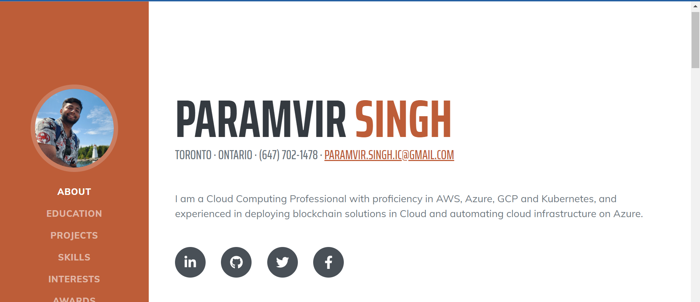

# portfolio-deployment
Portfolio website hosted on AWS S3 with complete terraform deployment

The portfolio uses s3 to host the webpage. The deployemnt is completely done by terraform.



This project provides Terraform code to deploy one of the three different portfolio websites using Amazon S3 for hosting. Each website is located in its respective directory under the project root, and the Terraform code is organized in a modular way in the `terraform` directory.

## Table of Contents

- [Prerequisites](#prerequisites)
- [Project Structure](#project-structure)
- [Terraform Configuration](#terraform-configuration)
- [Deploying the Websites](#deploying-the-websites)
- [Cleaning Up](#cleaning-up)

## Prerequisites

Before you begin, make sure you have the following prerequisites installed and configured:

- [Terraform](https://www.terraform.io/downloads.html): To manage infrastructure as code.
- [AWS CLI](https://aws.amazon.com/cli/): To authenticate and interact with AWS services.

You should also have your AWS credentials properly configured using the AWS CLI.

## Project Structure

The project is structured as follows:

- `terraform/`: Contains the Terraform code organized into modules for deploying the websites.
- `website/`, `website_2/`, `website_3/`: Each directory contains the HTML, CSS, and JavaScript code for one of the portfolio websites.

You can customize the content of each website by editing the respective files in the `website/`, `website_2/`, and `website_3/` directories.
You can select which website to be deployed by changing variable values in `terraform/main.tf` file.

## Terraform Configuration

1. Navigate to the `terraform/` directory:
```
    cd terraform
```
2. Initialize the terraform  configuration:
    terraform init

3. Customize the Terraform variables in the `terraform/main.tf` and `terraform/variables.tf`  file to suit your needs. You may need to set variables such as S3 bucket names, AWS region, and website directory paths.

4. Review and modify the Terraform code in the various .tf files to configure your S3 buckets and website deployments as required.

## Deploying the Websites

To deploy the portfolio websites, follow these steps:

1. From the terraform/ directory, plan the Terraform execution:
```
    terraform plan
```
2. If the plan looks good, apply the Terraform configuration to create the S3 buckets and configure the websites:
```
   terraform apply
```
3. After the apply is successful, Terraform will output the URL of the deployed website. You can access the website using that URL.

## Cleaning Up
To destroy the resources created by Terraform and clean up your deployment, go to terraform directory and run the command:
```
terraform destroy
```
Confirm the destruction of resources when prompted.

Verify that all resources have been successfully removed from your AWS account.

## Conclusion
You now have a modular Terraform configuration for deploying three portfolio websites using Amazon S3. Customize the websites in the respective directories, update the Terraform variables, and deploy them to showcase your work.


